# amazon-echo-dot-aux-speaker-switch
A circuit to detect the status of external speaker connected to the stereo jack of Amazon's Echo Dot and automatically switch on or off Echo Dot's built-in speaker.

## Problem to solve: 
Amazon Echo Dot has a 3.5mm stereo jack which allows it to hook up with some stereo system or amplifier with nice speakers.  However, once hooked up, the internal speaker is always disabled.  This can be a problem when the amplifier is powered off or switched to a different input.

## Desiging a simple detection circuit:
There are some considerations in designing such circuit:

First thing first.  The 3 mm stereo socket on Echo Dot has a mechanical switch which when the stereo jack is inserted, circuit become open.  This allows Echo Dot to sense whether a jack was inserted - when the circuit is open, Echo Dot will send audio signal to the external speaker; when the circuit is close, Echo Dot will use the internal speaker.  Since we want to leave the jack in the socket, we need something to close the circuit base on whether or not the stereo is on and the correct input is selected.

We need to then decide how to power our circuit.  There are three options to power the circuit - (a) having its own power source, or (b) draw power from the stereo/amplifier or (c) draw power from Echo Dot.  

The option of using a separate power might be the safest.  As we won't accidentally fry our nice stereo or Echo Dot.  However, it also means it requires one additional wall power outlet and more components to supply/regulate the voltage for the circuit.  We probably don't want to use the power from stereo/amplifier.  If we do that, then we cannot turn off the stereo/amplifier.  Otherwise, the circuit will stop working.  The conclusion: it is best to use Echo Dot to provide the power.

With the power source decided we then need to consider what to use as an indicator for switching on/off the internal speaker.  Most of the stereo or amplifier has a display panel with input indicator.  We can use that to determine whether or not we need to close the circuit of Echo Dot's mechanical sensor switch.

The last thing is that we need to isolate the circuit of stereo's input indicator and the auto switch circuit.  Since the auto switch circuit uses Echo Dot's power, it will need to have the common ground with Echo Dot.  It will be more complicated if we don't separate those circuits, or worse it might cause damage to either the stereo/amplifier, or Echo Dot, or both.  

Here is the schematic of the design:

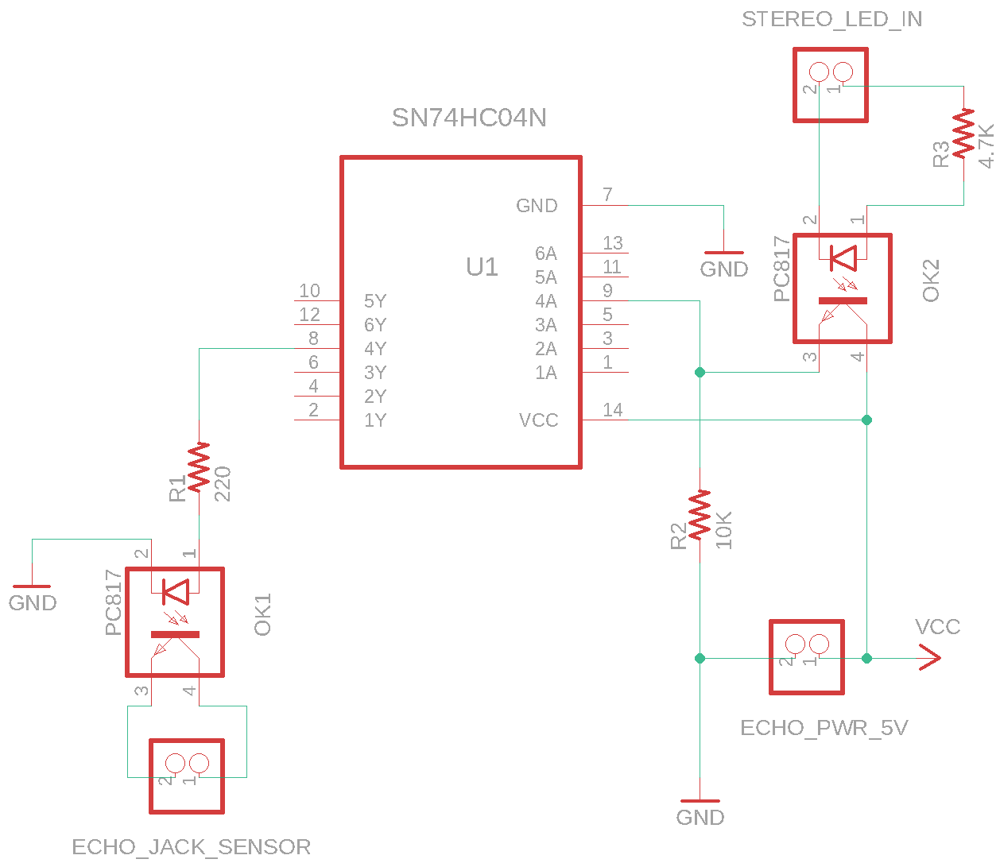

I used 2 photocouplers (PC817) here - one to detect the status of input indicator LED and the other to close Echo Dot's detector circuit.  The photocoupler is basically a tiny LED and a photo resistor in one package.  The way it works is that if there is enough votage difference between pin 1 and 2, it will light up the LED inside the package and the resistance between pin 3 and 4 will be reduced and become conductive.  We need to put a current limiting resistor to avoid burning out the LED.  Normally the 220 ohm registor will do.  However, notice the resistor for the STEREO_LED_IN is much higher (4.7K Ohm).  This is so that only enough current is diverted from the indicator to trigger the speaker switch but not too much that making the indicator too dim.  It might be necessary to try a few different resistor values for best result.

Another hurdle is that we need to open the circuit when the correct input indicator is on.  However, the photocoupler closes the circuit when the input is high - which is the opposite of what we need.  So I had to use a hex inverter (SN74HC04N) to reverse the signal.  The SN74HC04N hex inverter has four pairs of pins.  Each pair consists of an input pin (nA) and output pin (nY) where n=1~4.  When the input voltage is high then the output voltage will be low and vise versa.  In this case, I used pin 9 (4A) for taking input from the photocoupler output and pin 8 (4Y) to control the sensor dector circuit.  There is a 10K pull down resister connecting pin 9 to ground to ensure the logic 0/1 can be properly read by the hex inverter.  This can also be implemented with a simple NOT-gate using an NPN transistor.  I will update the simplified circuit in the future.

The end result - when the input indicator is off (i.e. external stereo / amplifier is off or the input selected is not connected to Echo Dot), the stereo jack detecter circuit will be closed.  This makes the sound coming out from Echo Dot so you can hear and interact with it.  When the right input indicator is lit, the detecter circuit will become open thus the sound will be coming out from the nice speakers.

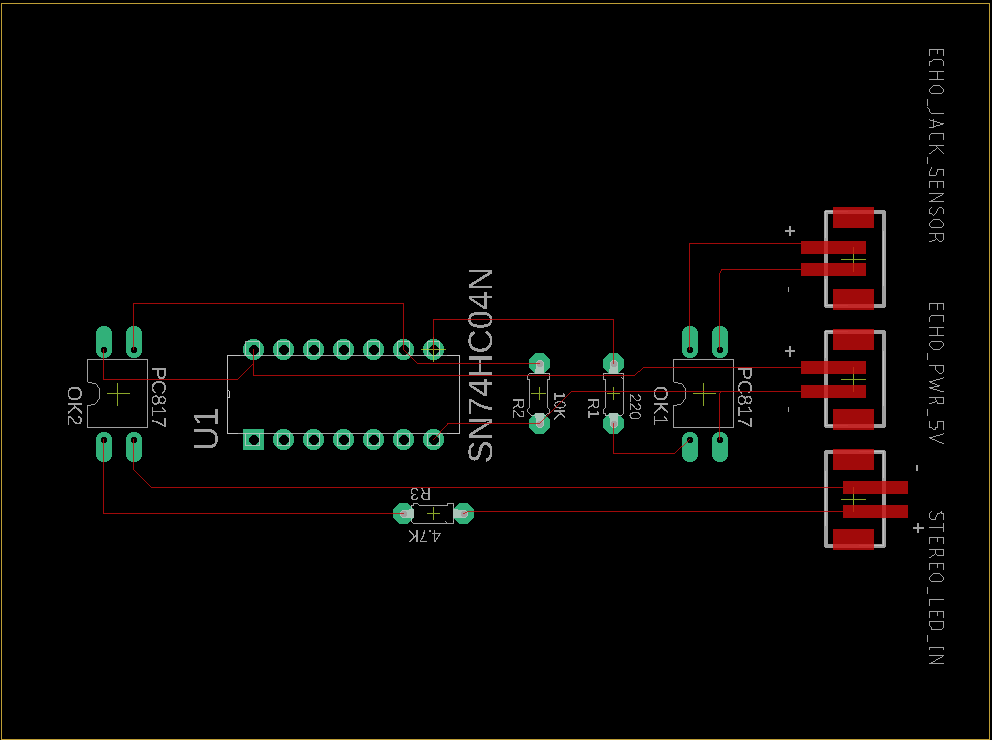
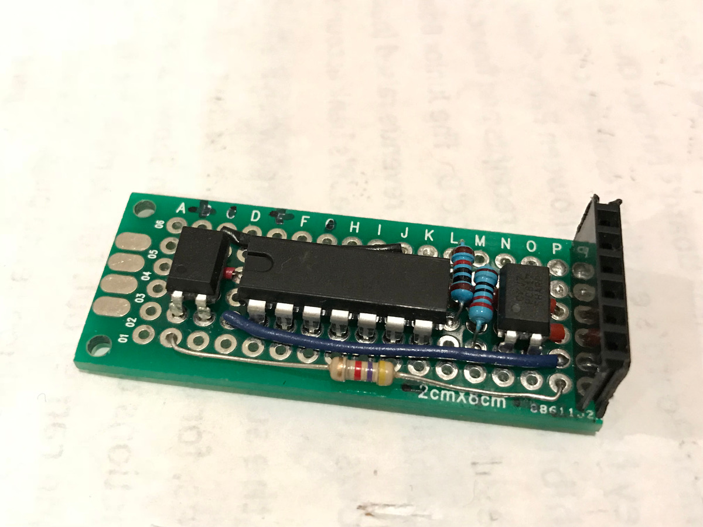

## Photos:

1. Wiring up with breadboard to make sure the circuit works
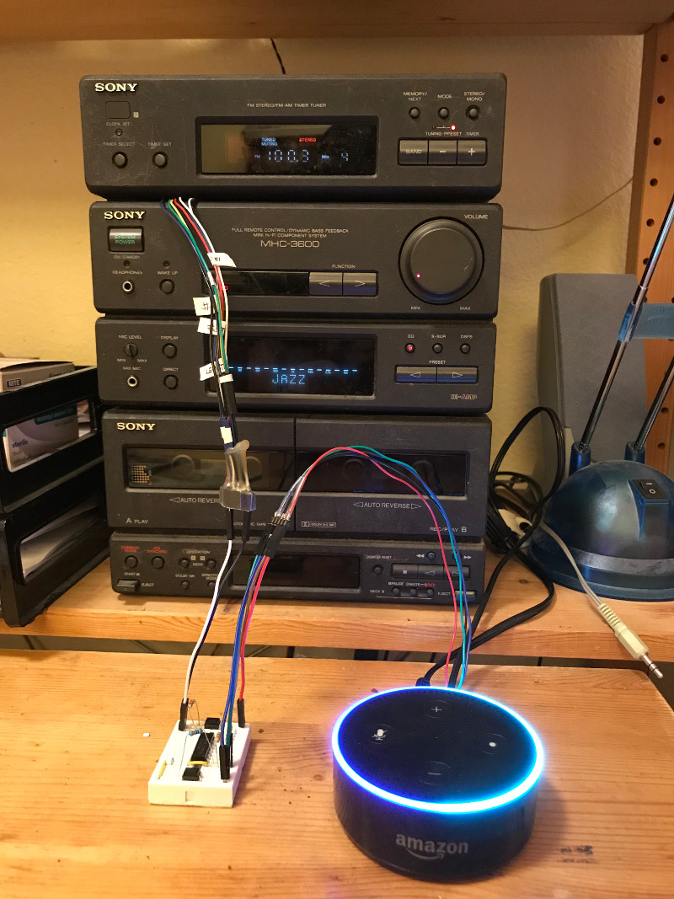

2. The jack sensor has 2 solder base on the circuit board located on the lower right of the image. There are a lot of places provide ground.  Use whichever is easier to solder on.  The +5 is the tiniest solder joint among them.  It is located at the top right of the cluster of four solder joints (reference the photo below) near the ground solder joints of the micro USB socket.  This one is hard to solder on and requires some patience and skill.  Double check the voltage of those solder joints with a multimeter before soldering.  Solder the wires for ground (black), +5V (red), mechanical sensor V-hi (green), V-lo (dark blue) and drill a hole on the case to run the wires through. 
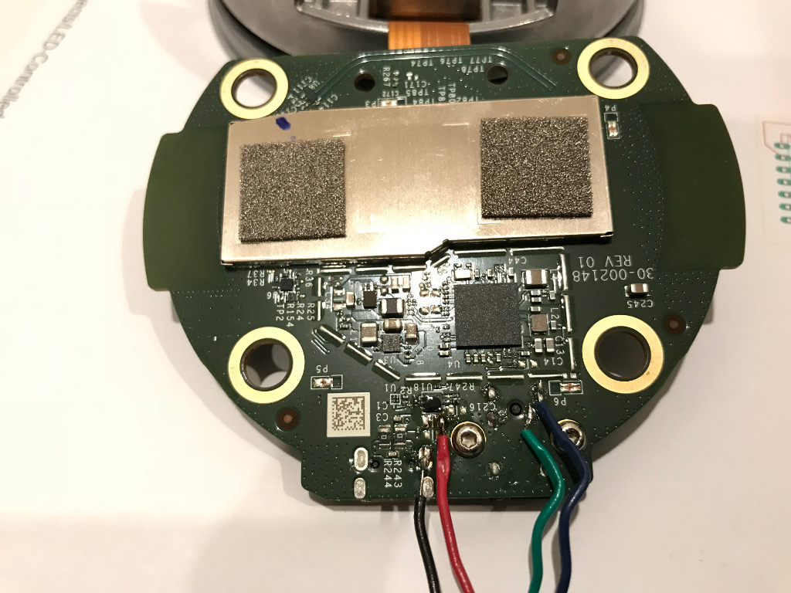

3. I also soldered on pin headers to those wires to make it easier to connect and disconnect to and from Echo Dot and the stereo/amplifier.  If you plan to use heat-shrink tube to secure the connectors, remember to put the tube in first before soldering the connectors.
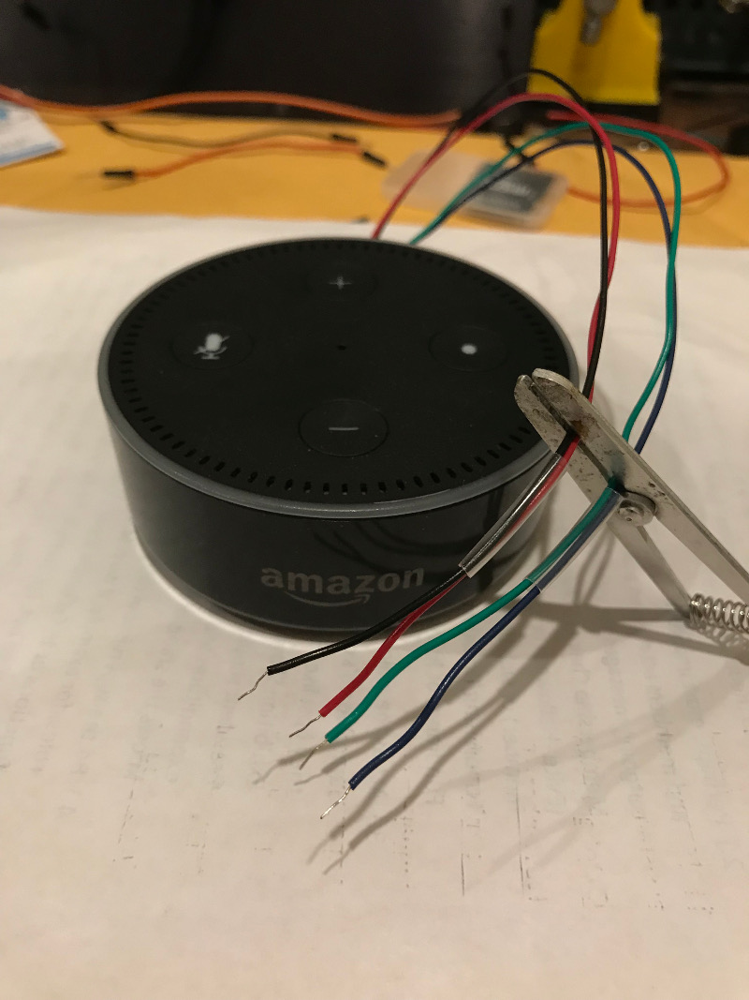

4. I took apart the stereo and used a multimeter to find the LED solder joints on the control panel of the stereo.  I soldered some different color wires from those joints then ran it outside of the stereo. I then make a connector for all those wires.  In the future, I can use a micro controller and perhaps an IR LED to control the stereo through Echo's voice interface.  The micro controller can detect if the stereo was on with expected input selected.  If not, I can send IR signal to control the stereo accordingly.
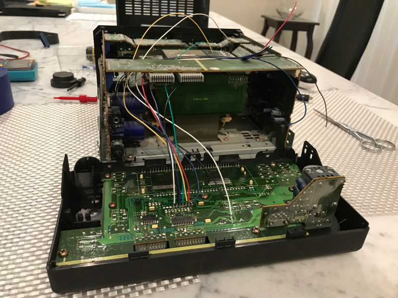

5. Close up view of the soldering places to the LED's on the control panel.
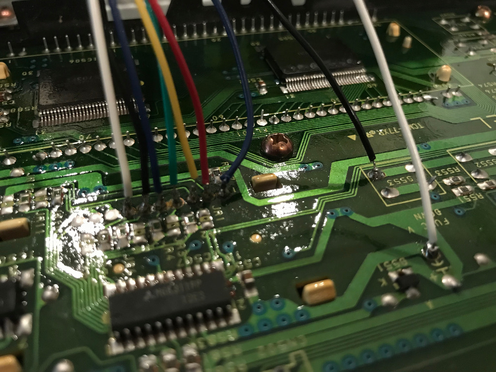

6. Tests the votage from the input indicator LED.
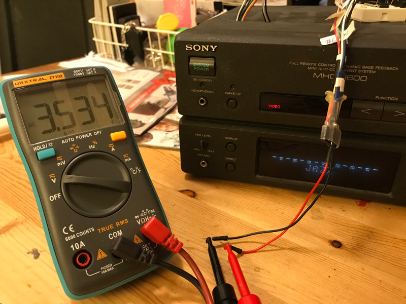

7. Transfer the breadboard to a prototype board and soldering up everything.  Then wire it up to the stereo.
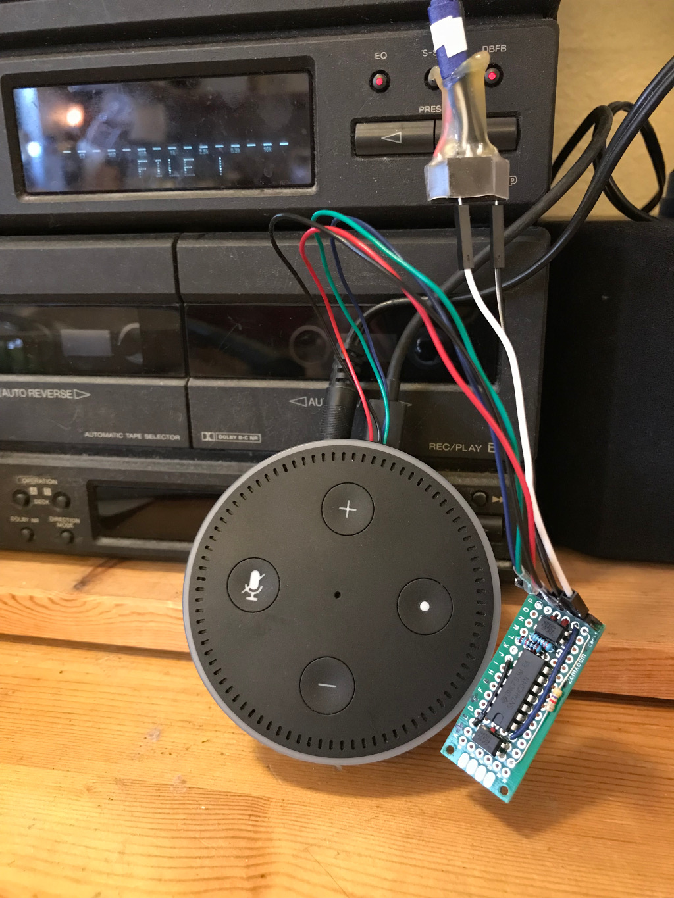

8. Close up view of the circuit on the prototype board.
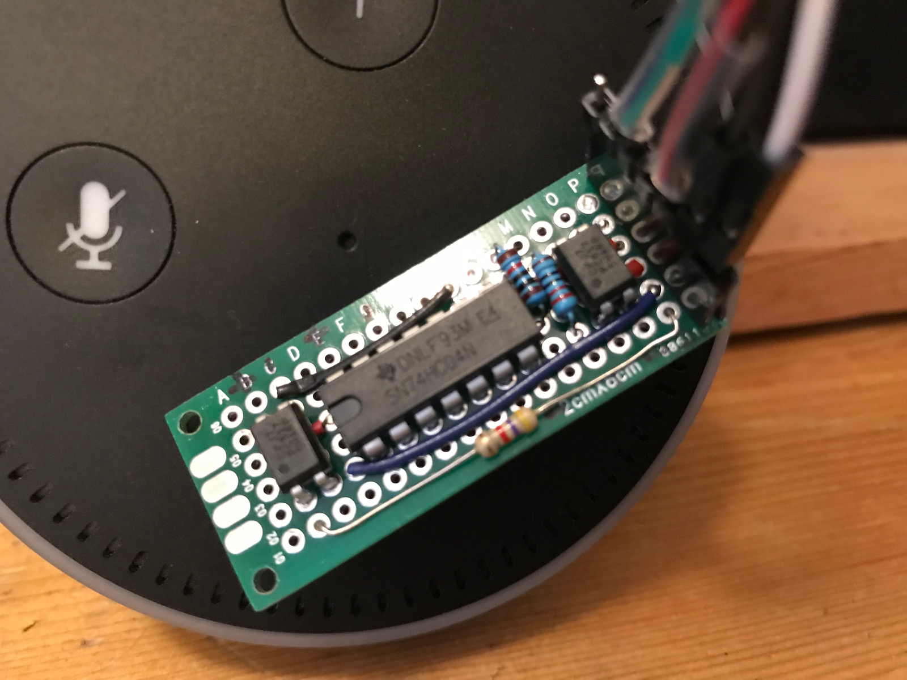

